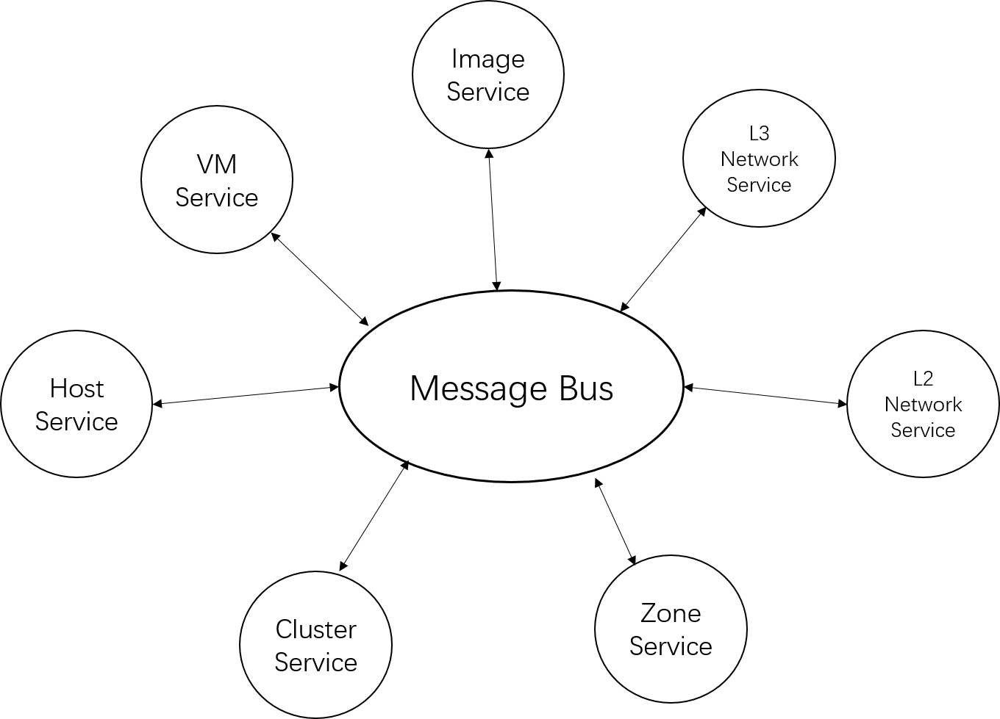

# 消息
## 事件驱动架构

在微服务中，服务之间的通信通过消息完成，不存在直接的函数调用。在ZStack中也**大体如此**，服务间通过一个称为`CloudBus`的消息中间件相互通信。

>在后面的插件框架章节你会看到ZStack的服务也可以通过被称为`extension point（扩展点）`的机制单向调用

模块间函数式调用是程序紧耦合的一个元凶，这在传统的分层结构程序中经常出现。当程序规模到达一定程度，程序层级结构越来越深，代码耦合越来越紧，成为剪不断理还乱的Spaghetti Code，就如下图一样：

解决的方法是将程序扁平化，变树形拓扑为星形拓扑。模块间并不直接相互调用，统一通过中央的消息总线交换消息，业务流程通过消息驱动，模块间甚至没有编译依赖，这就是我们所熟知的事件驱动架构（Event-driven Architecture)。

事件驱动架构天然具备分布式特性，只要消息总线可以跨进程跨机器通信，调用者和被调用者可以位于不同进程不同机器。这使得ZStack能够非常容易实现横向扩展，服务相互调用时，调用者并不关心被调用者是否在本地进程还是远端进程，一切由管理节点进程自带的*一致性哈希环*决定。

> **在分层架构中使用事件驱动**
> 
> 分层架构是最为常见的软件设计架构，在通常的面向对象设计中，软件通常分为：展现层（Presentation Layer）、应用层（Application Layer）、Business Layer（业务层）、Data Access Layer（数据层）。分层架构的的弱点在于层次之间采用函数直接调用，容易导致紧耦合产生巨石程序（Monolithic Application）。解决的方法是在层级之间使用事件驱动架构交互。
>
>微服务架构兴起后，由于其大量使用事件驱动架构，导致很多程序员认为事件驱动架构只存在分布式程序中，而且必须依赖消息中间件。事实并非如此。事件驱动架构也可以存在于单进程应用，并且不依赖于任何消息中间件。Linux的X11 server就是一个典型的例子。单进程事件驱动架构通常包含一个event loop作为事件分发引擎，程序的不同模块在event loop上注册处理事件的回调函数，在调用其他模块时通过向event loop发送消息，而不是直接调用其他模块的函数。这里event loop就相当于消息中间件，通过IO复用（IO multiplexing，在Linux中为select/poll系统调用）技术实现。
>
>自从9年在MeeGo（Nokia和Intel的一个失败的移动互联网操作系统）的sensorframework项目中开始使用事件驱动架构起，我已在多个项目中成功使用了该架构，无论他们是单进程的还是分布式的。目前看来，事件驱动架构是非常有效的解耦程序的方法。

## 消息总线

消息总线是ZStack的神经中枢，所有服务都依赖消息总线进行相互调用。在选择消息中间件时，我考察了JMS协议、AMQP协议和Zeromq，最终选择了基于AMQP协议的Rabbitmq。当时的考虑时候zeromq还不成熟，提供的机制比较底层，不易于使用；JMS虽然成熟，但跟Java绑定，不符合ZStack消息总线于语言无关的原则，所以最终选择了AMQP协议的Rabbitmq。

Rabbitmq可以负担20000/s ~ 100000/s的消息负载，并且提供灵活的路功能，生态中的插件和外围功能也非常齐全，完全满足ZStack控制面发送消息的要求。

