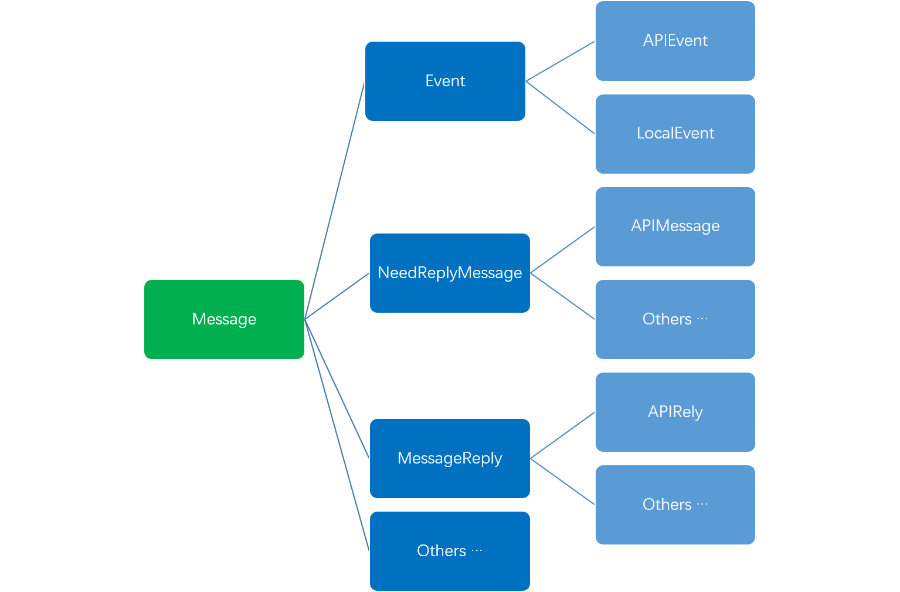

# 消息
## 事件驱动架构

在微服务中，服务之间的通信通过消息完成，不存在直接的函数调用。在ZStack中也**大体如此**，服务间通过一个称为`CloudBus`的消息中间件相互通信。

>在后面的插件框架章节你会看到ZStack的服务也可以通过被称为`extension point（扩展点）`的机制单向调用

模块间函数式调用是程序紧耦合的一个元凶，这在传统的分层结构程序中经常出现。当程序规模到达一定程度，程序层级结构越来越深，代码耦合越来越紧，成为剪不断理还乱的Spaghetti Code，就如下图一样：


解决的方法是将程序扁平化，变树形拓扑为星形拓扑。模块间并不直接相互调用，统一通过中央的消息总线交换消息，业务流程通过消息驱动，模块间甚至没有编译依赖，这就是我们所熟知的事件驱动架构（Event-driven Architecture)。


事件驱动架构天然具备分布式特性，只要消息总线可以跨进程跨机器通信，调用者和被调用者可以位于不同进程不同机器。这使得ZStack能够非常容易实现横向扩展，服务相互调用时，调用者并不关心被调用者是否在本地进程还是远端进程，一切由管理节点进程自带的*一致性哈希环*决定。


> **在分层架构中使用事件驱动**
> 
> 分层架构是最为常见的软件设计架构，在通常的面向对象设计中，软件通常分为：展现层（Presentation Layer）、应用层（Application Layer）、Business Layer（业务层）、Data Access Layer（数据层）。分层架构的的弱点在于层次之间采用函数直接调用，容易导致紧耦合产生巨石程序（Monolithic Application）。解决的方法是在层级之间使用事件驱动架构交互。
>
>微服务架构兴起后，由于其大量使用事件驱动架构，导致很多程序员认为事件驱动架构只存在分布式程序中，而且必须依赖消息中间件。事实并非如此。事件驱动架构也可以存在于单进程应用，并且不依赖于任何消息中间件。Linux的X11 server就是一个典型的例子。单进程事件驱动架构通常包含一个event loop作为事件分发引擎，程序的不同模块在event loop上注册处理事件的回调函数，在调用其他模块时通过向event loop发送消息，而不是直接调用其他模块的函数。这里event loop就相当于消息中间件，通过IO复用（IO multiplexing，在Linux中为select/poll系统调用）技术实现。
>
>自从9年前在MeeGo（Nokia和Intel的一个失败的移动互联网操作系统）的sensorframework项目中开始使用事件驱动架构起，我已在多个项目中成功使用了该架构，无论他们是单进程的还是分布式的。目前看来，事件驱动架构是非常有效的解耦程序的方法。

## 消息总线

消息总线是ZStack的神经中枢，所有服务都依赖消息总线进行相互调用。在选择消息中间件时，我考察了JMS协议、AMQP协议和Zeromq，最终选择了基于AMQP协议的Rabbitmq。当时的考虑是zeromq还不成熟，提供的机制比较底层，不易于使用；JMS虽然成熟，但跟Java绑定，不符合ZStack消息总线于语言无关的原则，所以最终选择了AMQP协议的Rabbitmq。

Rabbitmq可以负担20,000/s ~ 100,000/s的消息负载，并且提供灵路由的路功能，生态中的插件和外围功能也非常齐全，完全满足ZStack控制面发送消息的要求。与OpenStack不同，ZStack并没有将所有的agent通信都用Rabbitmq，也没有使用dynamic queue这类资源消耗的技术，而是采用了static queue的方式，并且每个服务只会创建一个queue。在一个双管理节点的部署中，queue的总数不超过100个。

ZStack的这种设计主要是考虑了在超大规模环境中，消息总线的性能和稳定性问题。设想一个拥有10万物理机的数据中心，如果每个物理机上的agent都接入同一个rabbitmq，将会产生10万个queue。在实际测试中，rabbitmq在创建到4万个queue时变得基本不可用，并且有内存泄露发生，重启机器后rabbitmq无法启动。为此，ZStack只是将rabbitmq用于服务间通信，服务与物理机上agent采用HTTP通信。HTTP无状态、connection on demand的特性非常适合大规模分布式场景，且各个语言都有非常成熟的HTTP库供使用。

ZStack消息总线包含两个Rabbitmq exchange，`BROADCAST`和`P2P`，前者用于广播，后者用于服务间点对点通信。每个服务都有唯一的queue与之对应，queue的命名规则为：
```
zstack.message.服务名字.管理节点UUID
```
例如`zstack.message.cluster.3a8e2ef4ab264e9caad8870b233437b2`。

在著名的《Enterprise Integration Pattern》中描述了一种dynamic channel（这里的channel对应rabbitmq的queue），其工作原理是消息的发送者在发送一条消息(request)前创建一个临时queue，并把该queue作为消息回复（reply）的返回地址设置在消息中，接收者处理完消息后将回复发送到临时queue中，发送者处理完回复后动态销毁该临时queue。也就是说，每一次消息通信都会有一个临时queue创建/销毁的动作。程序员的直觉告诉我这种教科书式的设计在真实系统中会带来非常大的系统负载，从而导致不稳定。很不幸，OpenStack的oslo.messaging中大量使用了dynamicc queue，导致其消息系统在高负载时非常不稳定。ZStack中的所有queue都是静态的，在高负载情况下（并发数万API）也能稳定工作。

>开发者可以在安装rabbitmq的机器上运行`rabbitmqctl list_queues`和`rabbitmqctl list_exchanges`查看ZStack所创建的queue和exchange

## 消息类型

下图是ZStack中消息继承关系总览：



ZStack中所有消息（包括request和reply）都源于一个根class: [Message.java](https://github.com/zstackorg/zstack/blob/787402c53d9749ab6e18add656d797750549ea82/header/src/main/java/org/zstack/header/message/Message.java)，它派生出的子类又包含下列几大类：

* **[Event.java](https://github.com/zstackorg/zstack/blob/787402c53d9749ab6e18add656d797750549ea82/header/src/main/java/org/zstack/header/message/Event.java)**: 事件，用于广播，所有订阅该事件的服务都能收到该事件的一份拷贝
  * **[APIEvent.java](https://github.com/zstackorg/zstack/blob/787402c53d9749ab6e18add656d797750549ea82/header/src/main/java/org/zstack/header/message/APIEvent.java)**： 代表API返回的event
  * **[LocalEvent.java](https://github.com/zstackorg/zstack/blob/787402c53d9749ab6e18add656d797750549ea82/header/src/main/java/org/zstack/header/message/LocalEvent.java)**：除API返回外的其它事件
* **[NeedReplyMessage.java](https://github.com/zstackorg/zstack/blob/787402c53d9749ab6e18add656d797750549ea82/header/src/main/java/org/zstack/header/message/NeedReplyMessage.java)**：需要回复消息请求，用于服务之间点对点通信
  * **[APIMessage.java](https://github.com/zstackorg/zstack/blob/787402c53d9749ab6e18add656d797750549ea82/header/src/main/java/org/zstack/header/message/APIMessage.java)**：代表API的消息请求
  * **Others**：需要回复的非API消息
* **[MessageReply.java](https://github.com/zstackorg/zstack/blob/787402c53d9749ab6e18add656d797750549ea82/header/src/main/java/org/zstack/header/message/MessageReply.java)**：消息回复
  * **[APIReply.java](https://github.com/zstackorg/zstack/blob/787402c53d9749ab6e18add656d797750549ea82/header/src/main/java/org/zstack/header/message/APIReply.java)**：API回复
  * **Others**：非API回复
* **Others**：所有不需要回复的非API消息


>**类型信息 —— 编译器的礼物**
>
>当你浏览ZStack消息的继承关系时，将发现很多消息继承了它的父类但却没有增加任何字段。例如APIReply.java：
>
>     package org.zstack.header.message;
>
>     public class APIReply extends MessageReply {
>     }
>  
>继承了父类MessageReply.java，但并没有定义额外字段，看似跟父类完全一样，有些多此一举。实际上APIReply.java包含了一个非常重要的隐藏内容：类型信息。由于该信息的存在，所有继承APIRely的class都自动具有了作为API回复的身份，无需我们添加额外字段说明。
>
>类型信息是编译器和面向对象编程送给程序员的礼物，它让我们无需在class中定义一个type字段来说明该class的用途。除了使用继承，在Java中还可以通过implement空interface给class添加多个类型信息。善用这些手段可以给OOP编程带来极大的方便，我们在后续的章节讲到服务入口时就会看到。

### 按发送方式分类

根据发送方式的不同，消息可以分为event和非event两种。对于event类消息，其发送接收方式为publish/subscribe，对该event感兴趣的服务在消息总线上订阅该event，发送者只需将event提交到总线，所有订阅者都会收到一份event的拷贝。例如

```java
APIDeleteEipEvent evt = new APIDeleteEipEvent(msg.getId());
bus.publish(evt);
```
在ZStack中event类型主要有两种：用于API返回的`APIEvent`和通报内部事件的·CanonicalEvent`。

非event类消息使用点对点通信，发送者需要在消息中指定接收者的`serviceId`，接收者在处理完消息后通过一个`MessageReply`返回结果给发送者。非event类消息是ZStack中使用最多的消息，主要用于服务间通信以及阻塞式API。

### 按是否需要回复分类

绝大多数ZStack消息请求需要回复，这类消息必须继承父类`NeedReplyMessage`。服务在处理完类型为`NeedReplyMesssage`类消息后必须发送一个回复，通常`MessageReply`的子类或者`APIEvent`的子类。

不需要回复的消息请求可以直接继承父类`Message`。这类消息主要用于要求接收者执行某项操作，但发送者并不关心操作执行的结果。例如`ReturnPrimaryStorageCapacityMsg`用于向primary storage归还容量，但发送者并不关心执行结果，因为primary storage服务应该保证容量归还始终成功。

### 按是否为API分类

继承父类`APIMessage`的消息带有API属性，它们跟非API消息最大的不同是，API消息的回复可以是一个event类消息（APIEvent）或一个非event类消息（APIReply），取决于API是阻塞类API还是非阻塞类API。

阻塞类API通常是*读*API，例如`APIQueryVmInstanceMsg`，调用者通常需要得到API的返回结果，才能执行后续的逻辑。阻塞类API的回复是一个`APIReply`，由API的执行者直接发送给API的调用者。

非阻塞类API通常执行某个操作，例如`APIStartVmInstanceMsg`，调用者无需等待API返回也可以执行后续逻辑。API执行者在完成操作后，通过一个`APIEvent`异步通知调用者。由于返回结果是一个event类消息，除API调用者外，其他服务也可以订阅API event来获知API执行的结果，例如对API执行结果进行审计的服务。

## 消息结构

